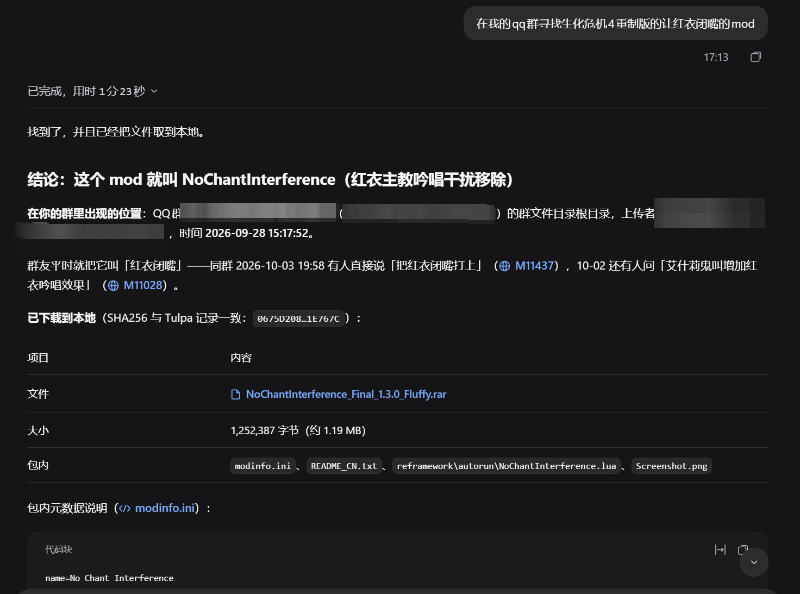

# Tulpa

**把 QQ / 微信资料接入几乎所有的桌面版 Agent，也让它在 QQ 里成为群友。**

[下载](#下载) · [快速开始](#快速开始) · [Agent 配置教程](doc/AGENT_SETUP.md) · [使用场景](#使用场景) · [完整文档](#常见问题与文档)

Tulpa 在本机整理聊天、图片和文件，让 Agent 按你授权的范围查资料、追溯消息，或带着自定义人格参与 QQ 群聊。已有 Agent 选 MCP 轻量版；想直接在 Tulpa 里提问，选完整版。

**Windows 10 / 11 x64。** 微信支持读取、回复草稿与复制，不能发送。QQ 持续群聊需要独立运行的 OneBot 服务、相应授权，以及持续执行的外部 Agent。

## 使用场景

下面是可以交给 Agent 的请求示例，实际能力取决于资料、授权、模型和客户端。

### 让小鲸鱼来水群

> 先列出可用人格和允许的 QQ 群，核对“我的测试群”后，用小鲸鱼持续聊天，直到我停止。接得上话再说，不必每条都回复。

随包提供小鲸鱼（`little_whale`）和龙娘（`dragon_girl`，测试版），也能用 Markdown 写自己的角色。支持按语境接话、原生 @ 与引用；授权后可看图、发送和收藏表情，保留理解笔记供后续会话选用。

人格卡只改变表达，不会替换底层模型；发言和表情使用由 Agent 决定。详见 [人格教程](doc/MCP_CHAT.md)与[表情链路](doc/MCP_STICKERS.md)。

视频链接：[点击这里查看哔哩哔哩视频](https://www.bilibili.com/video/BV16jHL6AE5z)

### 找回聊过的资料和文件

> 帮我找我的群里的一些我需要的附件，核对时间，并标出消息来源。

按关键词、人物、会话和日期检索，再展开上下文。图片、语音和文件按需读取；轻量版可经 OneBot 下载 QQ 群原文件，交给同机 Agent 自己的文件工具阅读。



### 把消息整理成有出处的总结

> 总结项目群这周确定的分工和待确认事项，把每项对应的原话列出来。

从消息和文件中整理结论，保留可回查的来源。完整版还提供回复草稿、会话记忆、关注卡和持续调查工作区；完整能力见[功能清单](doc/FEATURES.md)。

## 为什么用 Tulpa

- **复用熟悉的 Agent**：Tulpa 负责资料读取、检索和授权，外部 Agent 负责理解与任务执行；只用 MCP 无需在 Tulpa 另配模型 API Key。
- **范围由你决定**：按平台、会话、日期开放资料，写操作另行授权，每个客户端的连接可单独撤销。
- **查得到，也能回头核对**：从结论展开上下文、查看原文，按需取图片和文件，不必反复复制聊天。

已接入以下客户端：

 [Codex](doc/AGENT_SETUP.md#codex) ·
 [Claude Code](doc/AGENT_SETUP.md#claude-code) ·
 [DeepSeek Harness](doc/AGENT_SETUP.md#deepseek-harness) ·
 [Antigravity](doc/AGENT_SETUP.md#google-antigravity) ·
 [WorkBuddy](doc/AGENT_SETUP.md#workbuddy)

<details>
<summary>客户端实测范围</summary>

- **Codex / DeepSeek Harness**：已验证聊天查询、图片和文件读取，以及授权测试群发言、修改群名并恢复。
- **Claude Code**：已接入并由用户在本机确认功能正常，使用原生 HTTP MCP 与 Bearer Token。
- **Antigravity**：已验证消息查询和图片理解；验收仅开放只读权限，尚未实测持续群聊、发送与群管理。
- **WorkBuddy**：已接入并由用户确认跑通；调用记录覆盖消息、图片、文件、群资料及人格发现。

客户端的识图、工具审批与持续运行机制不同。详见 [Agent 教程](doc/AGENT_SETUP.md)和[验证记录](doc/VALIDATION.md)。

</details>

## 下载

| 版本 | 适合你，如果你想… | v0.5.3 下载 |
| --- | --- | --- |
| **MCP 轻量版** | 使用已有 Agent 查资料或参与 QQ 群聊 | [约 94 MB](https://github.com/fumingyang2004/Tulpa/releases/download/v0.5.3/Tulpa-MCP-0.5.3-win-x64.zip) |
| **完整版** | 在 Tulpa 内提问，使用回复、记忆和工作区；也能接外部 Agent | [约 907 MB](https://github.com/fumingyang2004/Tulpa/releases/download/v0.5.3/Tulpa-0.5.3-win-x64.zip) |

两版都有 Python 和相同的 MCP 能力。完整版内置 Harness、本地 OCR / 语音 / Office 解析与固定 WebView2；轻量版使用系统 WebView2 Evergreen Runtime，语音模型按需安装。[版本区别](doc/MCP_LITE.md) · [最新发布](https://github.com/fumingyang2004/Tulpa/releases/latest) · [0.5.3 更新说明](doc/releases/0.5.3.md)

需要 **.NET Framework 4.8**。下载 ZIP 后完整解压到可写目录，打开 `Tulpa/Tulpa.exe`；不要从压缩包直接运行。**`Source code` 不是安装包，两版不要混装。** QQ / 微信客户端、模型服务及可选 OneBot 服务需自行准备。

**老用户升级：** 按[保留数据升级教程](doc/UPGRADE.md)检查、备份并更新原目录，无需重新导入。自改的同名随包人格先另存；升级后仍打开原目录 EXE，并重连 MCP。

## 快速开始

### SnowLuma 自动接入（离线预览）

当前开发版已加入托管接入状态机，按 SnowLuma **v1.14.22** 审核接口和下载校验。预期流程为：打开 Tulpa → 主动同意协议与自动配置 → 必要时选择 QQ / 扫码 → 自动核对 HTTP、实时事件与登录账号。

**自动部署尚未开放。** 尚未取得 SnowLuma EULA 第 5.4 条要求的作者书面授权；本预览仅完成隔离测试，不下载或启动 SnowLuma，不清理旧配置。页面会说明阻塞原因；现有外部 OneBot 和历史资料查询继续可用。[流程、取消与恢复](doc/SNOWLUMA_MANAGED.md) · [验收范围](doc/SNOWLUMA_MANAGED_VALIDATION.md)

### 我要 QQ 水群

**无需先导入整库历史。** 这条路径直接接收 OneBot 实时事件。

1. 启动 QQ、独立 OneBot 服务和 Tulpa。持续群聊需要 **HTTP + 正向 WebSocket**；已有 SnowLuma 可选择其文件夹、账号和节点，检测后导入连接。Tulpa 不附带或下载 SnowLuma。[连接教程](doc/SNOWLUMA_SETUP.md)
2. 在 **连接外部 Agent**（或 **外部 Agent / MCP**）选择 QQ，点击 **从 OneBot 选择群 · 无需导入**，只选测试群；截止日期留空以接收未来消息。
3. 开放持续群聊和发送权限，按需加看图、表情发送或收藏。创建连接、检测工具，再按 [Agent 教程](doc/AGENT_SETUP.md)配置并重连客户端。
4. 在外部 Agent 的**专用对话**中使用上面的水群示例。想换龙娘，选择 `dragon_girl`。新人格放进当前安装目录的 `chatlocal/prompts/mcp_chat/`，重新列出即可发现。

保持 QQ、OneBot、Tulpa 和外部 Agent 运行。宿主结束回合、达到预算、退出或休眠后，Tulpa 不会自行继续推理。可在 Tulpa 点 **停止聊天 / 停止全部群聊**；已发出的消息不会因此撤回。改过人格后，停止并重新开启会话才会采用新设定。

### 我要查 QQ / 微信历史

1. 登录本机 QQ / 微信，在 **数据与同步 → 本机账号**核对账号，再选会话和日期读取。可以从少量近期消息开始。
2. **用外部 Agent**：创建独立 MCP 连接，选择资料范围和需要的图片、文件、语音权限，检测成功后按[教程](doc/AGENT_SETUP.md)接入。
3. **用内置聊天**：选择完整版，在 **模型与连接**填写 API 地址、API Key 和模型名称，回到对话页提问。
4. 从上面的资料查询或总结示例开始，用 **浏览聊天记录**核对原文。

本地历史查询和草稿不需要 OneBot。读取范围受客户端版本、账号、权限及本机缓存影响，无法保证找回未取得的历史；见[数据读取](doc/IMPORTS.md)与[实时摄取](doc/LIVE_INGESTION.md)。

## 隐私与权限

- **资料保存在本机，不等于完全离线。** 必要消息片段会进入你选择的模型服务；启用识图时也会发送所选图片。
- 看图、发送、收藏和群管理分别授权，默认关闭、可撤销。**MCP 的发送和群管理勾选后是持续授权，调用直接执行，不会逐条回到 Tulpa 审批。**
- 普通 **帮我回复**先生成可编辑草稿，批准后才发送 QQ 文本；微信只能草稿和复制。
- 不要分享使用过的整个安装目录，尤其是 `data/`、`imports/`、`.env`、Token 和私人诊断。撤销连接不能收回已交给客户端的内容；MCP 范围限制也不是整台电脑的文件隔离。

## 常见问题与文档

**能一直后台水群吗？** 持续群聊依赖外部 Agent 保持执行。托盘可保留 Tulpa 服务，但内置 Harness 不会自动变成水群机器人。

**连上了却读不到资料？** 先核对来源账号、导入状态、授权范围和日期，再实际调用工具验证；配置成功不代表数据可读。看 [连接验证与排错](doc/AGENT_SETUP.md#重启与常见问题)。

**模型的总结可靠吗？** 检索只覆盖已取得且已授权的资料，引用可回查不代表解释一定正确，重要结论请核对原文。

- 接入与群聊：[Agent 教程](doc/AGENT_SETUP.md) · [MCP 权限](doc/MCP.md) · [OneBot](doc/SNOWLUMA_SETUP.md) · [人格](doc/MCP_CHAT.md) · [表情](doc/MCP_STICKERS.md)
- 资料与调查：[文件](doc/ARTIFACTS.md) · [语音](doc/VOICE.md) · [调查与证据](doc/INVESTIGATION.md) · [工作区](doc/WORKSPACES.md) · [会话记忆](doc/TULPA.md)
- 功能与维护：[完整功能](doc/FEATURES.md) · [回复助手](doc/REPLY_COPILOT.md) · [群管理](doc/GROUP_MANAGEMENT.md) · [升级](doc/UPGRADE.md) · [安全报告](doc/SECURITY.md)

## 参与开发

<details>
<summary>从源码运行与贡献</summary>

需要 Windows x64、Python 3.13 和 Git，在 PowerShell 执行：

```powershell
git clone https://github.com/fumingyang2004/Tulpa.git
cd Tulpa
.\setup.ps1
.\start.ps1
```

打开 <http://127.0.0.1:7860/?desktop=1>。首次 setup 会联网安装依赖与读取模块；浏览器入口用于开发和测试。

[贡献指南](doc/CONTRIBUTING.md) · [桌面构建](doc/DESKTOP.md) · [验证说明](doc/VALIDATION.md)

</details>

## 许可与致谢

Tulpa 自有代码采用 [MIT License](LICENSE)，第三方组件、模型与客户端遵循各自许可，见 [THIRD_PARTY.md](doc/THIRD_PARTY.md)。本项目不是腾讯官方产品，与 QQ、微信及模型服务商没有隶属关系。

- [qq-bridge](https://github.com/Derpyu520/qq-bridge)：群聊行为与提示词设计参考；小鲸鱼基于其角色卡，由 Tulpa 维护者改编，保留来源和 MIT 许可。
- [QQ-agent](https://github.com/K0nd1us/QQ-agent)：表情收藏、语义笔记、候选与用量反馈的设计参考；Tulpa 按自身授权和媒体校验机制独立实现。
- [SnowLuma](https://github.com/SnowLuma/SnowLuma)：提供 QQ / OneBot 接入能力，需独立安装并遵循其许可。

